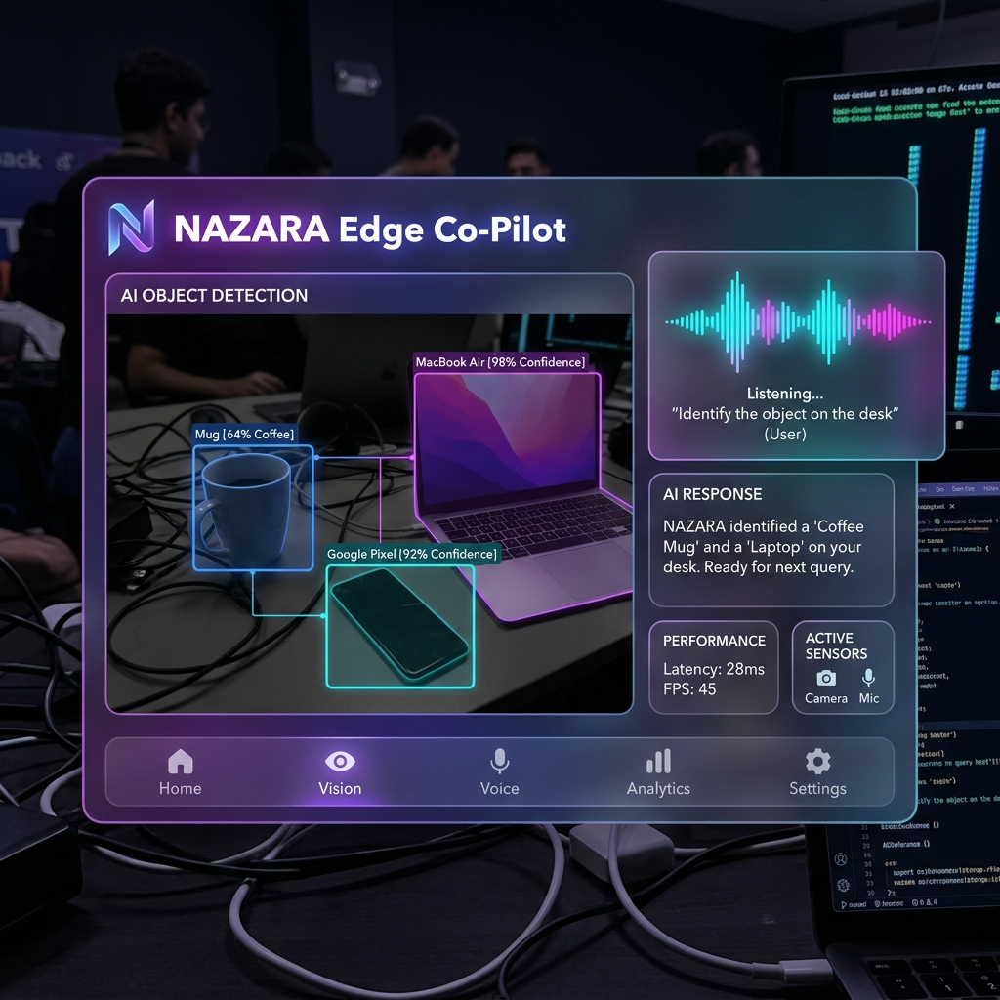

<div align="center">
  
  <br/>
  <h1>👁️ NAZARA: Edge-Native Spatial Co-Pilot</h1>
  <p><strong>Offline. Real-time. Multimodal. Powered entirely by Gemma 4.</strong></p>
</div>

<br/>

## 🚀 The Problem We're Solving

Building assistive AI for the visually impaired usually involves chaining heavy microservices together (Whisper for audio + Tesseract for OCR + GPT-4 for logic + ElevenLabs for TTS). That pipeline is brittle, slow, and expensive. It crashes if you lose 5G, and the latency makes real-time obstacle avoidance impossible.

**NAZARA** flips the script. 

Instead of wrapping an LLM in a heavy pipeline, NAZARA leverages the true multimodal embedding space of **Google Gemma 4 (`e4b-it`)**. By directly ingesting raw camera frames and raw `16kHz` audio waveforms natively into the processor, we completely eliminate the ASR and OCR overhead, resulting in a blistering **sub-1.5s end-to-end latency** running locally on a 16GB T4 GPU.

## 🛠️ Architecture Highlights

- **Zero API Keys Required**: NAZARA runs 100% locally via open weights and `edge-tts`.
- **True Multimodal Ingestion**: We pass `librosa` audio byte-arrays straight into the `AutoProcessor`. No external Speech-to-Text translation.
- **`<|think|>` Extraction**: Gemma 4's spatial geometry calculations happen natively in the reasoning block. We parse and decouple these tokens in the UI so the TTS engine only speaks the critical alert.
- **Native Tool Calling**: Pydantic schemas enforce strict JSON function calls (e.g., `verify_medication_expiry`), mapped directly to local Python dispatchers.
- **Kaggle T4 Optimized**: 4-bit quantization via `BitsAndBytesConfig` + strict PyTorch Garbage Collection (`gc.collect()` & `empty_cache()`) guarantees we never breach the 12GB free-tier ceiling.

## ⚙️ Quickstart (Kaggle/Colab)

We've packaged the entire pipeline into a single runnable Jupyter Notebook for instant deployment.

1. Upload `nazara_gemma4_demo.ipynb` to Kaggle.
2. Select the **T4 x2** accelerator.
3. Run all cells. 
4. The final cell will generate a public **Gradio `share=True` link**. Open it on your smartphone, grant camera/mic permissions, and start navigating!

*Want to run it locally?*
```bash
git clone https://github.com/haroon2109/Nazara.git
cd Nazara
pip install -r requirements.txt
python app.py
```

## 🧠 Core Features

| Mode | Input Modalities | Gemma 4 Action | TTS Output |
| :--- | :--- | :--- | :--- |
| **Spatial Navigation** | Camera + Voice Command | Native spatial mapping, clock-face orientation estimation | "Coffee table at 12 o'clock, 2 meters." |
| **Document Audit** | Camera | Native multimodal OCR parsing (bypassing Tesseract) | Reads critical banknote/letter info. |
| **Medication Safety** | Camera + Voice Command | Extracts expiration dates and invokes `verify_medication_expiry` tool | "Medication expired. Do not use." |

---
*Built with coffee, PyTorch, and Gemma 4 during an intense 48-hour sprint.*
